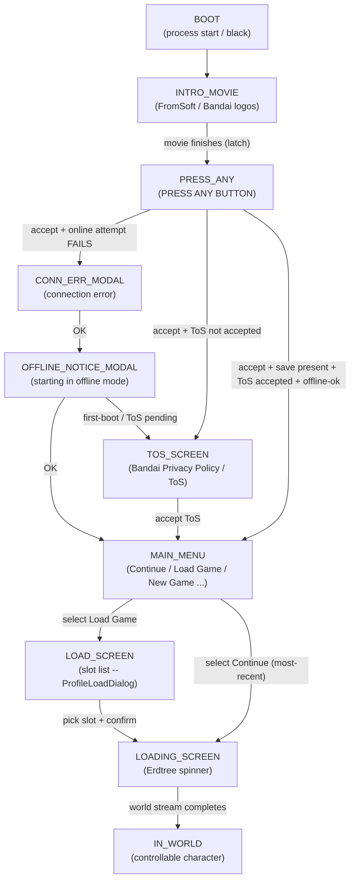

# Elden Ring boot -> menu -> world state DAG

Purpose: a shared vocabulary of **named nodes** so we can say precisely "we are at `LOAD_SCREEN`"
or "the obligatory edge is `MAIN_MENU -> LOAD_SCREEN`". Every node has BOTH:

- **Visual** -- what a human sees on screen.
- **Verifiable** -- an in-process signature the DLL/telemetry can read to confirm the node
  *without* a screenshot (computer-verifiable).

Addresses are live/deobf RVAs unless noted. Base `0x140000000`.
GameMan = `*0x143d69918`. GameDataMan = `*0x143d5df38`.
ProfileSummary = `*(GameDataMan + 0x78)`.

## Node table (visual <-> verifiable)

| ID | Visual | Computer-verifiable signature |
|----|--------|-------------------------------|
| `BOOT` | black / process just started | `GameMan == 0` (singleton not built); our DLL attach hooks logged |
| `INTRO_MOVIE` | FromSoft/Bandai logo movie | movie singleton `*0x14458b890 != 0` AND movie-finish latch `*0x143d856a0 == 0` (still playing) |
| `PRESS_ANY` | "PRESS ANY BUTTON" | SimpleTitleStep owner `+0x48 == 10` (`MenuJobWait`); TitleTopDialog (`owner+0xe0`, vt `0x142b26468`) SM `+0xa60` in **FadeIn/Loop**; menu-open latch `[dialog+0xa40] == 0` |
| `CONN_ERR_MODAL` | "A connection error occurred / Unable to start in online mode" | a live `CS::MessageBoxDialog` (vt `0x142b03550`); telemetry `oracle_msgbox_total_builds > 0` |
| `OFFLINE_NOTICE_MODAL` | "Starting in offline mode..." | another `CS::MessageBoxDialog` (vt `0x142b03550`) built after CONN_ERR |
| `TOS_SCREEN` | Bandai Namco Privacy Policy / Terms | `TosMultiLangDialog` (RTTI `0x142b28100`, wrapper `0x1409b6070`); telemetry `oracle_policy_window_total_builds > 0` |
| `MAIN_MENU` | Continue / Load Game / New Game / Settings / Quit | TitleTopDialog SM `+0xa60` in **TextFadeOut**; menu-open latch `[dialog+0xa40] == 1`; `owner+0x48 == 10` still |
| `LOAD_SCREEN` | slot list ("Load which save?") | `owner+0xe0` vtable becomes **ProfileLoadDialog** (`0x142b21bf8`; RTTI `0x142b229f8`); row bound `[dialog+0xb08] > 0`; cursor `[dialog+0xb0c]`. **Side effect (the crux):** save-list scan sets `[ProfileSummary+8+slot] = 1` per occupied slot AND **primes the FD4 IO worker lane** |
| `LOADING_SCREEN` | black + ELDEN RING + Erdtree icon | `oracle_now_loading == 1` (`*(u8*)(*0x143d60ec8 + 0xED)`); `GameMan+0xb80` reached `3` (resident) then load proceeds; CSFeMan `*0x143d6b880 != 0` |
| `IN_WORLD` | rendered, controllable character | `oracle_now_loading == 0`; `player_available`/`oracle_player_present == true`; `oracle_grounded == true`; `GameMan+0xc30 == real map` (`!= 0xa010000` for non-m10 chars); `oracle_char_level == save level` |

## Edge table (trigger: visual action <-> computer mechanism <-> verifiable delta)

| Edge | Visual action | Computer mechanism | Verifiable delta |
|------|---------------|--------------------|------------------|
| `INTRO->PRESS_ANY` | wait | intro thread sets movie-finish latch | `*0x143d856a0 : 0 -> 1` |
| `PRESS_ANY->{CONN/TOS/MAIN}` | press any button | accept flag `*0x144589bdc` set -> title advance (`SetState(2)->3->10`) | `owner+0x48` cycles `10->2->3->10`; `GameMan+0xc30 : 0xffffffff -> 0xa010000` (new-game default written by BeginTitle) |
| `*->CONN_ERR` | (none) | boot online login attempt fails | MessageBoxDialog vt `0x142b03550` appears; `oracle_msgbox_total_builds++`. **Suppressed** by online-disable patch (`IsOnlineMode` getter `0x67a030 -> xor eax,eax;ret`) |
| `CONN/OFFLINE->next` | press OK | OK-handler `0x14078e030(dialog)` (or auto-accept) | `[dialog+0x3b0] : 0 -> 1` (closing latch); dialog freed |
| `*->TOS` | (none) | title advance builds `TosMultiLangDialog` when ToS-accepted state unsatisfied | `oracle_policy_window_total_builds++` |
| `->MAIN_MENU` | (lands here) | TitleTopDialog SM settles to TextFadeOut; open-menu registrar `0x1409b24e0` | `[dialog+0xa40] : 0 -> 1` |
| `MAIN_MENU->LOAD_SCREEN` | highlight **Load Game** + confirm | fire the `MenuMemberFuncJob` node -> `dialog_factory 0x14081ead0` -> ProfileLoadDialog ctor (its scan primes the IO lane) | `owner+0xe0` vtable -> `0x142b21bf8`; `[ProfileSummary+8+slot] : 0 -> 1`; **IO lane primed (read now drains)** |
| `MAIN_MENU->LOADING` | highlight **Continue** + confirm | `continue_confirm 0x140b0e180` reads `GameMan+0xc30` -> `owner+0xbc` -> `SetState(5)` | `owner+0x4c -> 5`; `oracle_now_loading -> 1` |
| `LOAD_SCREEN->LOADING` | pick slot + confirm | initiator `0x67b1a0(slot)` (b80=2) -> selector `0x826510` -> FD4-pumped `menu_deser 0x82c240` -> c30 commit `0x67bd70` (full `0x280000`) -> `continue_confirm`->`SetState(5)` | `GameMan+0xac0 -> slot`; `GameMan+0xb80 : 2 -> 3`; `GameMan+0xc30 -> real map`; `oracle_now_loading -> 1` |
| `LOADING->IN_WORLD` | wait for stream | MoveMapStep world stream -> resident | `oracle_now_loading : 1 -> 0`; `player_available -> true` |

## Where the project's goals sit on this DAG

- **The captured live load (2026-06-21)** = `MAIN_MENU -> LOAD_SCREEN -> LOADING -> IN_WORLD`, with the chain in the last edge proven live under Wine (`bd LIVE-CONTINUE-LOAD-CHAIN-captured-swbp-2026-06-21`).
- **The wall**: the `LOAD_SCREEN->LOADING` edge only drains the read when the IO worker lane is **live**, and the lane is primed by **entering `LOAD_SCREEN`** (the ProfileLoadDialog save-list scan). At `PRESS_ANY` and even `MAIN_MENU` the same submit completes empty (`b80` 2->0).
- **"Menu-free zero-input" goal** = reach `IN_WORLD` while **skipping the visual nodes** `PRESS_ANY`/`CONN_ERR`/`TOS`/`MAIN_MENU` and the user-visible `LOAD_SCREEN` navigation -- i.e. reproduce the *side effect* of `LOAD_SCREEN` (lane priming + slot activation) cold, then fire the captured `LOAD_SCREEN->LOADING` chain. The obligatory thing is the **`LOAD_SCREEN` scan side effect**, not the screen's pixels.

## Open / not-yet-pinned (flag before trusting)

- Exact telemetry field names for some signatures (`oracle_now_loading`, `oracle_msgbox_total_builds`, etc.) are as used in `src/telemetry.rs`; verify against current source before wiring a verifier.
- The precise **lane-priming step** inside the ProfileLoadDialog scan (what specifically makes the FD4 IO worker service reads) is the one thing still not isolated -- this is the crux for cold/menu-free.
- `PRESS_ANY -> MAIN_MENU` direct (no modals) depends on online/ToS-accepted state; the offline patch changes which path is taken.
